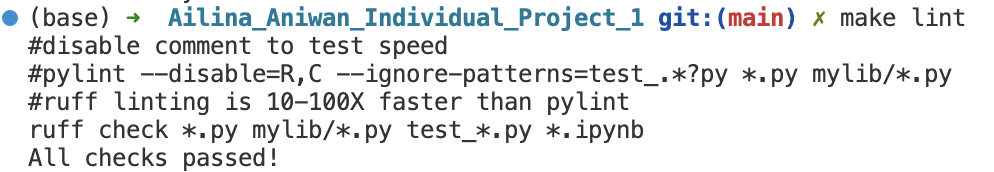
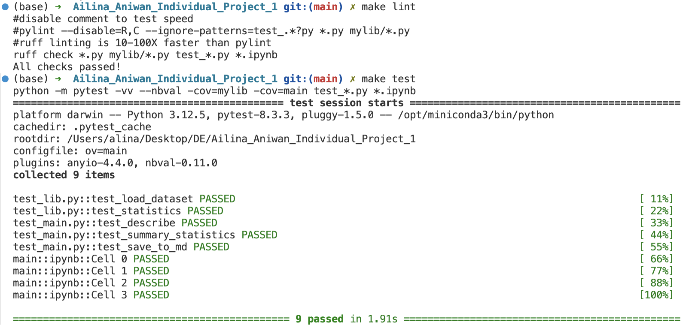

[](https://github.com/nogibjj/Ailina_Aniwan_Individual_Project_1/actions/workflows/install.yml)
[](https://github.com/nogibjj/Ailina_Aniwan_Individual_Project_1/actions/workflows/format.yml)
[](https://github.com/nogibjj/Ailina_Aniwan_Individual_Project_1/actions/workflows/lint.yml)
[](https://github.com/nogibjj/Ailina_Aniwan_Individual_Project_1/actions/workflows/test.yml)
# IDS706 - Individual Project 1 - Ailina Aniwan

## Continous Integration using Github Actions of Python Data Science Project

## Overview
This project demonstrates the implementation of continuous integration practices in a Python Data Science project, focusing on automating the workflows for formatting, linting, testing, and dependency installation using GitHub Actions. The project incorporates a Python script and a Jupyter Notebook that both perform descriptive statistical analysis. This setup exemplifies best practices in code development, version control, and automated testing to ensure code quality and functionality.

## YouTube Video
[Click Here For Demo](https://www.youtube.com/watch?v=pGTLPDXGixA)

## Project Directory
```
Ailina_Aniwan_Individual_Project_1/
├── .devcontainer/
│   ├── devcontainer.json
│   └── Dockerfile
├── .github/
│   └── workflows/
│       ├── format.yml
│       ├── install.yml
│       ├── lint.yml
│       └── test.yml
├── mylib/
│   ├── __init__.py
│   └── lib.py
├── .gitignore
├── Dockerfile
├── figure.png
├── LICENSE
├── lint.png
├── main.ipynb
├── main.py
├── Makefile
├── README.md
├── repeat.sh
├── requirements.txt
├── setup.sh
├── summary.md
├── test_lib.py
├── test_main.py
└── test.png

```

## Project Overview
This project analyzes global alcohol consumption using the **drinks.csv** dataset from [FiveThirtyEight](https://github.com/fivethirtyeight/data). It uses Python with **Pandas** for statistical analysis and **Matplotlib** for data visualization to explore the consumption of beer, spirits, and wine across different countries.

## Data Source

The dataset is sourced from [FiveThirtyEight’s alcohol consumption dataset](https://raw.githubusercontent.com/fivethirtyeight/data/master/alcohol-consumption/drinks.csv). It includes the following columns:
- **country**: The country name.
- **beer_servings**: Average beer servings per capita.
- **spirit_servings**: Average spirit servings per capita.
- **wine_servings**: Average wine servings per capita.
- **total_litres_of_pure_alcohol**: Total litres of pure alcohol consumed per capita.

## Descriptive Statistics
- **Mean**: The average number of servings.
- **Median**: The middle value in the data.
- **Standard Deviation**: The variability in servings across countries.

These statistics provide insights into the overall trends and distribution of alcohol consumption.

## Data Visualization

**grouped bar chart** was created to compare the mean, median, and standard deviation for beer, spirits, and wine. This visualization helps identify the central tendencies and spread of alcohol consumption across different categories.


According to the chart:

- **Beer Servings**: Beer has the highest mean and median servings, with relatively low variability (standard deviation).
- **Spirit Servings**: Spirits show high variability, as the standard deviation is almost equal to the mean, indicating greater inconsistency in consumption across countries.
- **Wine Servings**: Wine has the lowest mean and median, but a relatively large standard deviation, indicating that while average consumption is low, there are significant outliers.

## Check format and test errors
1. Format code `make format`
2. Lint code `make lint`



3. Test code `make test`



## References
https://github.com/nogibjj/python-ruff-template